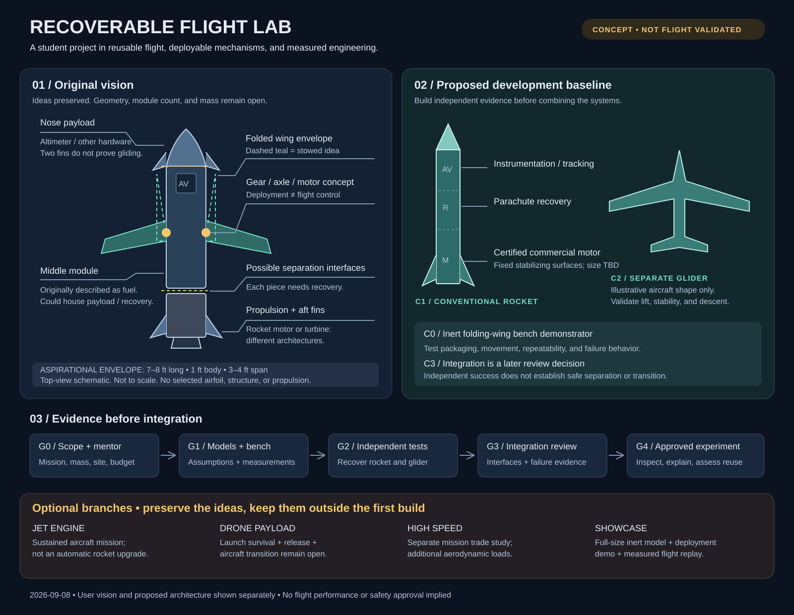

# Recoverable Flight Lab

Student rocketry, recoverable hardware, and an experimental deployable-wing glider.

**Status: concept and development specification, 2026-09-08. No vehicle has been designed for manufacture, simulated, or flight-qualified here.**

The long-term idea is a modular rocket with a recoverable nose payload and folding wings. The proposed first build is a smaller conventional rocket with commercial certified propulsion and established recovery. A glider and an inert wing mechanism develop separately before any integration decision.

This diagram preserves the original ideas and distinguishes them from the proposed baseline. It is a schematic, not a fabrication drawing.

[Download PNG](docs/diagrams/concept.svg.png) · [Editable SVG](docs/diagrams/concept.svg)

## Read the project

| Document | Owns |
|---|---|
| [User vision](USER-VISION.md) | Original intent, desired experience, unresolved preferences |
| [System specification](docs/SYSTEM-SPEC.md) | Configuration, requirements, interfaces, acceptance evidence |
| [Development roadmap](docs/ROADMAP.md) | Milestones, physical work, roles, budget structure, test records |
| [Simulation plan](docs/SIMULATION-PLAN.md) | Model fidelity, inputs, validation, guidance scope |
| [Propulsion and recovery choices](docs/TRADE-STUDIES.md) | Engine acquisition, jet comparison, visual presentation, alternatives |
| [Risk and decision register](docs/REGISTERS.md) | Open questions, hazards, decisions, next owners |
| [Sources](docs/SOURCES.md) | Primary references and their limits |
| [Current state](STATE.md) | Completed work and the next bounded task |

## Working conventions

Keep user aspirations distinct from accepted engineering decisions. Record each new decision with its evidence and revisit trigger.

Keep geometry editable. Record units, assumptions, source versions, and measured values with every analysis. Mark illustrations and synthetic data clearly.

Use commercial certified motors through a qualified mentor and approved launch process. This repository contains no custom engine fabrication, propellant recipes, ignition procedures, or operational ascent-guidance implementation.

Private repository at creation. Team membership, public release, and licensing remain owner decisions. Third-party software keeps its own license.
